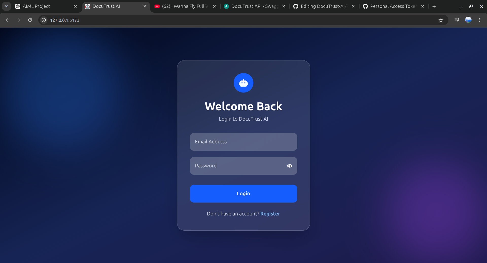
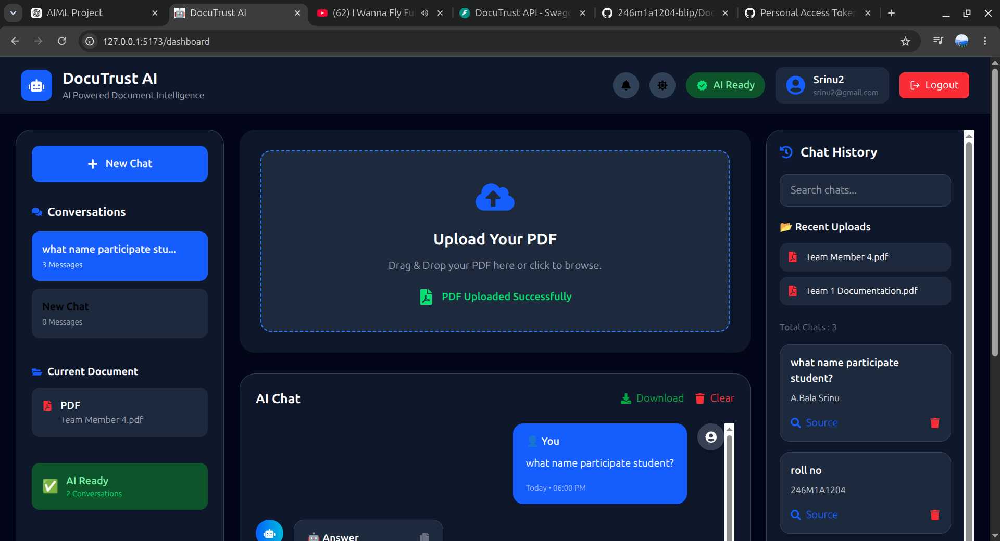
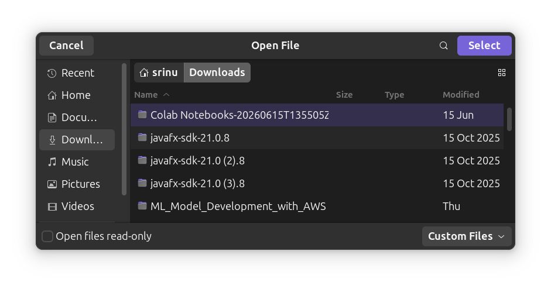

# 🚀 DocuTrust AI

> **AI-Powered Intelligent Document Question Answering System**

DocuTrust AI is a full-stack web application that enables users to upload PDF documents and interact with them using natural language. The system extracts text, generates semantic embeddings, performs vector similarity search using FAISS, and answers user questions with the help of Large Language Models.

---

## ✨ Features

- 🔐 Secure JWT Authentication
- 👤 User Registration & Login
- 📄 Upload and Process PDF Documents
- 🤖 AI-Powered Question Answering
- 🧠 Semantic Search using FAISS
- 📚 Intelligent Text Chunking
- ⚡ Sentence Transformer Embeddings
- 💬 Interactive Chat Interface
- 🌙 Dark / Light Mode
- 📁 User-specific Document Management
- 🗂 Recent Upload History
- 🔒 PostgreSQL Database Integration

---

## 🏗️ Tech Stack

### Frontend

- React.js
- Tailwind CSS
- Axios
- React Router
- React Hot Toast
- React Icons

### Backend

- FastAPI
- SQLAlchemy
- PostgreSQL
- JWT Authentication
- Passlib (bcrypt)

### AI & NLP

- Sentence Transformers
- FAISS Vector Database
- Hugging Face Models

---

## 📂 Project Structure

```
DocuTrust/
│
├── Backend/
│   ├── app/
│   │   ├── models/
│   │   ├── routes/
│   │   ├── services/
│   │   ├── utils/
│   │   └── main.py
│   └── uploads/
│
├── Frontend/
│   ├── src/
│   │   ├── components/
│   │   ├── pages/
│   │   ├── services/
│   │   └── App.jsx
│
└── README.md
```

---

## ⚙️ Installation

### Clone Repository

```bash
git clone https://github.com/YOUR_USERNAME/DocuTrust.git

cd DocuTrust
```

---

## Backend Setup

```bash
cd Backend

python -m venv venv

source venv/bin/activate
```

Install dependencies

```bash
pip install -r requirements.txt
```

Run FastAPI

```bash
uvicorn main:app --reload
```

Backend runs on

```
http://127.0.0.1:8000
```

---

## Frontend Setup

```bash
cd Frontend

npm install

npm run dev
```

Frontend runs on

```
http://localhost:5173
```

---

## Database

PostgreSQL is used for storing:

- Users
- Uploaded Documents
- Authentication Data

---

## API Endpoints

| Method | Endpoint | Description |
|----------|----------------|----------------------------|
| POST | /auth/register | Register User |
| POST | /auth/login | Login User |
| GET | /profile | User Profile |
| POST | /upload | Upload PDF |
| GET | /documents | User Documents |
| POST | /chat | Ask Questions |

---

## Authentication

The application uses JWT Authentication.

After successful login, every protected request includes

```
Authorization: Bearer <JWT_TOKEN>
```

---

## Screenshots

### Login



### Dashboard



### Upload PDF



---

## Future Enhancements

- AI Answer Citations
- Multiple PDF Chat
- Document Delete
- User Profile
- Chat History Database
- Export Conversations
- Cloud Deployment
- Docker Support

---

## Author

**ATMAKURI VEERA VENKATA BALA SRINU**

GitHub:
https://github.com/YOUR_USERNAME

LinkedIn:
https://linkedin.com/in/YOUR_LINKEDIN

---

## License

This project is developed for educational and portfolio purposes.

© 2026 DocuTrust AI
